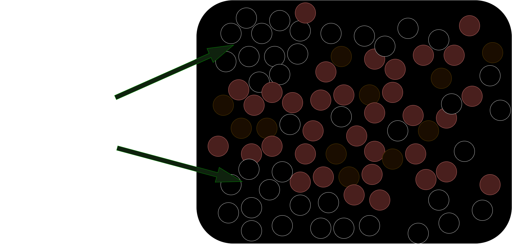

# Products API with Express, TypeScript, and Azure Cosmos DB (NoSQL) using Vector Search


In the competitive landscape of e-commerce, delivering precise and relevant search results is crucial for enhancing user experience and driving sales. Traditional keyword-based search methods often struggle to grasp the nuanced intentions behind user queries. This is where **vector similarity search** comes into play, leveraging advanced embedding techniques to provide more accurate and context-aware search results. In this blog, we'll walk you through implementing vector similarity search in an e-commerce products API using **Azure Cosmos DB for NoSQL** and **TypeScript(JavaScript)**.

## Introduction to Vector Similarity Search

Vector similarity search is a powerful technique that transforms data into high-dimensional vectors (embeddings) and enables the comparison of these vectors to find similarities. In the context of e-commerce, this allows for more intelligent product searches, recommendations, and categorization by understanding the semantic meaning behind product descriptions, tags, and features.
### Embeddings

Modern machine learning models can be trained to convert raw data into embeddings, represented as arrays (or vectors) of floating point numbers of fixed dimensionality. What makes embeddings useful in practice is that the position of an embedding in vector space captures some of the semantics of the data, depending on the type of model and how it was trained. Points that are close to each other in vector space are considered similar (or appear in similar contexts), and points that are far away are considered dissimilar.

Large datasets of multi-modal data (text, audio, images, etc.) can be converted into embeddings with the appropriate model. Projecting the vectors' principal components in 2D space results in groups of vectors that represent similar concepts clustering together, as shown below.
### Indexes
Embeddings for a given dataset are made searchable via an index. The index is constructed by using data structures that store the embeddings such that it's very efficient to perform scans and lookups on them
### Brute force search

The simplest way to perform vector search is to perform a brute force search, without an index, where the distance between the query vector and all the vectors in the database are computed, with the top-k closest vectors returned. This is equivalent to a k-nearest neighbours (kNN) search in vector space.

As you can imagine, the brute force approach is not scalable for datasets larger than a few hundred thousand vectors, as the latency of the search grows linearly with the size of the dataset. This is where approximate nearest neighbour (ANN) algorithms come in.

## Overview of Azure Cosmos DB Vector Search

**Azure Cosmos DB for NoSQL** now offers a vector search feature in preview, designed to handle high-dimensional vectors efficiently and accurately at any scale. This feature allows you to store vectors directly within your documents alongside traditional schema-free data. By colocating data and vectors, Azure Cosmos DB ensures efficient indexing and searching, simplifying data management and enhancing AI application architectures.

Key capabilities include:

- **Vector Embedding Policies:** Define how vectors are generated and stored within your documents.
- **Vector Indexing:** Optimize data retrieval based on vector similarities using various indexing methods.
- **Vector Distance Functions:** Utilize metrics like Cosine, Dot Product, and Euclidean to measure similarity.

By integrating vector similarity search into your e-commerce API, you can significantly enhance the relevance and personalization of search results.

## Prerequisites
- Node.js installed on your system
- An Azure Cosmos DB for NoSQL account
- Register for Azure Cosmos DB Vector Search `preview` as described in your input

# Getting Started with a detailed blog 👇👇

[Quick Start to this project](./https://techcommunity.microsoft.com/t5/educator-developer-blog/enhancing-e-commerce-product-search-with-vector-similarity-in/ba-p/4282881)

Or

Clone the repository and install the dependencies using npm:

```bash
git clone https://github.com/kelcho-spense/products-api-cosmosdb-typescript-vector-search.git

cd products-api-cosmosdb-typescript-vector-search

npm install
```


## Dummy project data For Testing
```json
[
  {
    "name": "Wireless Bluetooth Headphones",
    "brand": "SoundMax",
    "sku": "SKU-1001",
    "category": "Electronics",
    "price": 149.99,
    "currency": "USD",
    "stock": 250,
    "description": "Experience unparalleled sound quality with SoundMax Wireless Bluetooth Headphones. Featuring active noise cancellation, 30-hour battery life, and a comfortable over-ear design.",
    "features": "Bluetooth 5.0, Active Noise Cancellation, 30-hour Battery Life, Over-Ear Comfort, Built-in Microphone, Foldable Design",
    "rating": 4.5,
    "reviewsCount": 1200,
    "tags": ["audio", "wireless", "headphones", "electronics", "noise-cancelling"],
    "imageUrl": "https://example.com/images/products/SKU-1001.jpg",
    "manufacturer": "SoundMax Inc.",
    "model": "SM-BT1001",
    "releaseDate": "2023-05-15",
    "warranty": "2 years",
    "dimensions": {
      "weight": "250g",
      "width": "20cm",
      "height": "18cm",
      "depth": "7cm"
    },
    "color": "Black",
    "material": "Plastic and Metal",
    "origin": "USA"
  },
  {
    "name": "Smart LED Light Bulb",
    "brand": "BrightHome",
    "sku": "SKU-1002",
    "category": "Home Automation",
    "price": 19.99,
    "currency": "USD",
    "stock": 500,
    "description": "Illuminate your home with BrightHome Smart LED Light Bulbs. Control brightness and color temperature via smartphone or voice commands.",
    "features": "Wi-Fi Enabled, Voice Control Compatible, Energy Efficient, Adjustable Brightness, Long Lifespan, Easy Installation",
    "rating": 4.3,
    "reviewsCount": 850,
    "tags": ["lighting", "smart home", "LED", "energy-efficient", "voice-control"],
    "imageUrl": "https://example.com/images/products/SKU-1002.jpg",
    "manufacturer": "BrightHome Technologies",
    "model": "BH-SMART-LB",
    "releaseDate": "2023-07-20",
    "warranty": "1 year",
    "dimensions": {
      "weight": "75g",
      "width": "6.5cm",
      "height": "11cm",
      "depth": "6.5cm"
    },
    "color": "White",
    "material": "Glass and Plastic",
    "origin": "Germany"
  },
  {
    "name": "4K Ultra HD Action Camera",
    "brand": "AdventureCam",
    "sku": "SKU-1003",
    "category": "Photography",
    "price": 249.99,
    "currency": "USD",
    "stock": 150,
    "description": "Capture every adventure in stunning 4K Ultra HD with AdventureCam Action Cameras. Waterproof, shockproof, and built for extreme conditions.",
    "features": "4K Video Recording, Waterproof up to 30m, Wi-Fi Connectivity, Image Stabilization, Wide-Angle Lens, Long Battery Life",
    "rating": 4.6,
    "reviewsCount": 620,
    "tags": ["camera", "action", "4K", "waterproof", "photography"],
    "imageUrl": "https://example.com/images/products/SKU-1003.jpg",
    "manufacturer": "AdventureCam LLC",
    "model": "AC-4KUHD",
    "releaseDate": "2023-03-10",
    "warranty": "2 years",
    "dimensions": {
      "weight": "180g",
      "width": "7cm",
      "height": "5cm",
      "depth": "4cm"
    },
    "color": "Red",
    "material": "Aluminum and Plastic",
    "origin": "China"
  },
  {
    "name": "Ergonomic Office Chair",
    "brand": "ComfortSeat",
    "sku": "SKU-1004",
    "category": "Furniture",
    "price": 199.99,
    "currency": "USD",
    "stock": 80,
    "description": "Upgrade your workspace with the ComfortSeat Ergonomic Office Chair. Designed for maximum support and comfort during long working hours.",
    "features": "Adjustable Height, Lumbar Support, Breathable Mesh Back, Reclining Function, Swivel Base, Armrest Adjustment",
    "rating": 4.7,
    "reviewsCount": 430,
    "tags": ["furniture", "office", "ergonomic", "chair", "comfort"],
    "imageUrl": "https://example.com/images/products/SKU-1004.jpg",
    "manufacturer": "ComfortSeat Corp.",
    "model": "CS-ERGONOMIC-01",
    "releaseDate": "2023-01-25",
    "warranty": "3 years",
    "dimensions": {
      "weight": "12kg",
      "width": "70cm",
      "height": "120cm",
      "depth": "70cm"
    },
    "color": "Gray",
    "material": "Mesh and Metal",
    "origin": "Sweden"
  },
  {
    "name": "Stainless Steel Blender",
    "brand": "KitchenPro",
    "sku": "SKU-1005",
    "category": "Kitchen Appliances",
    "price": 89.99,
    "currency": "USD",
    "stock": 300,
    "description": "Blend smoothies, soups, and more with the KitchenPro Stainless Steel Blender. Powerful motor and durable blades for all your blending needs.",
    "features": "1000W Motor, 1.5L Capacity, Stainless Steel Blades, Multiple Speed Settings, Pulse Function, Easy Clean",
    "rating": 4.4,
    "reviewsCount": 920,
    "tags": ["kitchen", "blender", "appliances", "stainless steel", "smoothies"],
    "imageUrl": "https://example.com/images/products/SKU-1005.jpg",
    "manufacturer": "KitchenPro Industries",
    "model": "KP-BLEND-1000",
    "releaseDate": "2023-04-18",
    "warranty": "2 years",
    "dimensions": {
      "weight": "3kg",
      "width": "15cm",
      "height": "40cm",
      "depth": "15cm"
    },
    "color": "Silver",
    "material": "Stainless Steel and Plastic",
    "origin": "Italy"
  },
  {
    "name": "Fitness Tracker Watch",
    "brand": "HealthMate",
    "sku": "SKU-1006",
    "category": "Wearables",
    "price": 59.99,
    "currency": "USD",
    "stock": 400,
    "description": "Monitor your health and fitness goals with the HealthMate Fitness Tracker Watch. Features heart rate monitoring, step counting, and sleep tracking.",
    "features": "Heart Rate Monitor, Step Counter, Sleep Tracking, Waterproof, Smartphone Notifications, Long Battery Life",
    "rating": 4.2,
    "reviewsCount": 1500,
    "tags": ["fitness", "tracker", "watch", "wearables", "health"],
    "imageUrl": "https://example.com/images/products/SKU-1006.jpg",
    "manufacturer": "HealthMate LLC",
    "model": "HM-FIT-2023",
    "releaseDate": "2023-02-05",
    "warranty": "1 year",
    "dimensions": {
      "weight": "50g",
      "width": "4cm",
      "height": "4cm",
      "depth": "1cm"
    },
    "color": "Blue",
    "material": "Silicone and Plastic",
    "origin": "South Korea"
  },
  {
    "name": "Portable Power Bank 20000mAh",
    "brand": "ChargeUp",
    "sku": "SKU-1007",
    "category": "Mobile Accessories",
    "price": 39.99,
    "currency": "USD",
    "stock": 600,
    "description": "Stay powered on the go with the ChargeUp Portable Power Bank. High-capacity 20000mAh battery ensures your devices stay charged throughout the day.",
    "features": "20000mAh Capacity, Dual USB Ports, Fast Charging, LED Indicator, Lightweight Design, Durable Build",
    "rating": 4.5,
    "reviewsCount": 2100,
    "tags": ["power bank", "portable", "charging", "mobile", "accessories"],
    "imageUrl": "https://example.com/images/products/SKU-1007.jpg",
    "manufacturer": "ChargeUp Technologies",
    "model": "CU-PB20000",
    "releaseDate": "2023-06-12",
    "warranty": "1 year",
    "dimensions": {
      "weight": "500g",
      "width": "7cm",
      "height": "18cm",
      "depth": "7cm"
    },
    "color": "Black",
    "material": "Aluminum and Plastic",
    "origin": "Japan"
  },
  {
    "name": "Smart Thermostat",
    "brand": "HomeSmart",
    "sku": "SKU-1008",
    "category": "Home Automation",
    "price": 129.99,
    "currency": "USD",
    "stock": 180,
    "description": "Optimize your home's temperature with the HomeSmart Smart Thermostat. Features remote control, scheduling, and energy usage reports.",
    "features": "Remote Control via App, Scheduling, Energy Usage Reports, Voice Control Compatible, Easy Installation, Sleek Design",
    "rating": 4.6,
    "reviewsCount": 760,
    "tags": ["thermostat", "smart home", "energy-efficient", "automation", "control"],
    "imageUrl": "https://example.com/images/products/SKU-1008.jpg",
    "manufacturer": "HomeSmart Inc.",
    "model": "HS-THERMO-2023",
    "releaseDate": "2023-08-01",
    "warranty": "2 years",
    "dimensions": {
      "weight": "300g",
      "width": "10cm",
      "height": "15cm",
      "depth": "3cm"
    },
    "color": "White",
    "material": "Plastic and Metal",
    "origin": "USA"
  },
  {
    "name": "Gaming Mechanical Keyboard",
    "brand": "GameMaster",
    "sku": "SKU-1009",
    "category": "Computer Accessories",
    "price": 109.99,
    "currency": "USD",
    "stock": 220,
    "description": "Enhance your gaming experience with the GameMaster Mechanical Keyboard. Features customizable RGB lighting, tactile switches, and durable build.",
    "features": "Mechanical Switches, RGB Backlighting, Programmable Keys, N-Key Rollover, USB Passthrough, Detachable Wrist Rest",
    "rating": 4.8,
    "reviewsCount": 980,
    "tags": ["keyboard", "gaming", "mechanical", "RGB", "computer"],
    "imageUrl": "https://example.com/images/products/SKU-1009.jpg",
    "manufacturer": "GameMaster Technologies",
    "model": "GM-MK1009",
    "releaseDate": "2023-09-10",
    "warranty": "3 years",
    "dimensions": {
      "weight": "900g",
      "width": "45cm",
      "height": "5cm",
      "depth": "15cm"
    },
    "color": "Black",
    "material": "Aluminum and Plastic",
    "origin": "Taiwan"
  },
  {
    "name": "Wireless Charging Pad",
    "brand": "ChargeWave",
    "sku": "SKU-1010",
    "category": "Mobile Accessories",
    "price": 29.99,
    "currency": "USD",
    "stock": 450,
    "description": "Conveniently charge your devices with the ChargeWave Wireless Charging Pad. Compatible with all Qi-enabled devices and features fast charging capabilities.",
    "features": "Qi-Compatible, Fast Charging, Non-Slip Surface, LED Indicator, Slim Design, Overcharge Protection",
    "rating": 4.3,
    "reviewsCount": 1340,
    "tags": ["charging", "wireless", "mobile", "accessories", "fast-charging"],
    "imageUrl": "https://example.com/images/products/SKU-1010.jpg",
    "manufacturer": "ChargeWave Ltd.",
    "model": "CW-WCP300",
    "releaseDate": "2023-07-05",
    "warranty": "1 year",
    "dimensions": {
      "weight": "200g",
      "width": "10cm",
      "height": "1cm",
      "depth": "10cm"
    },
    "color": "White",
    "material": "Plastic",
    "origin": "South Korea"
  }
]


```
